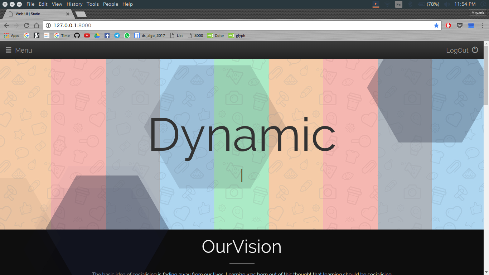
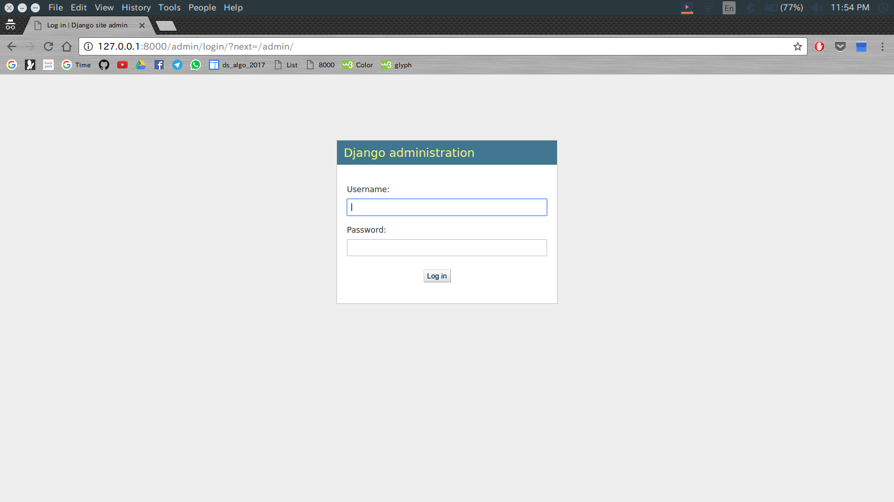
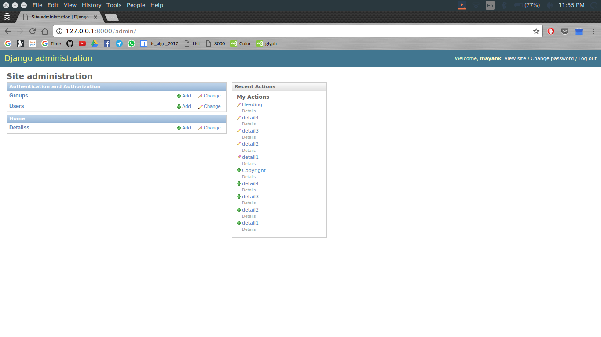
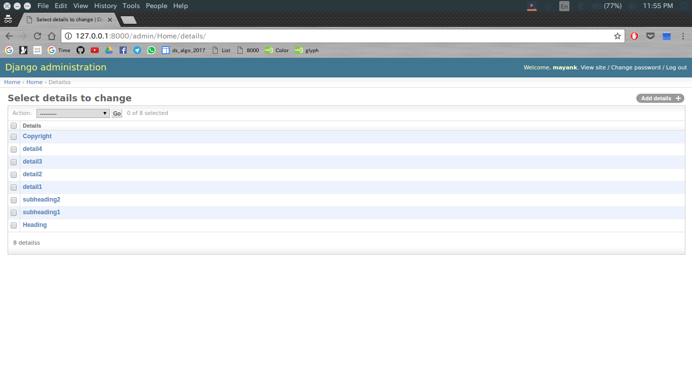
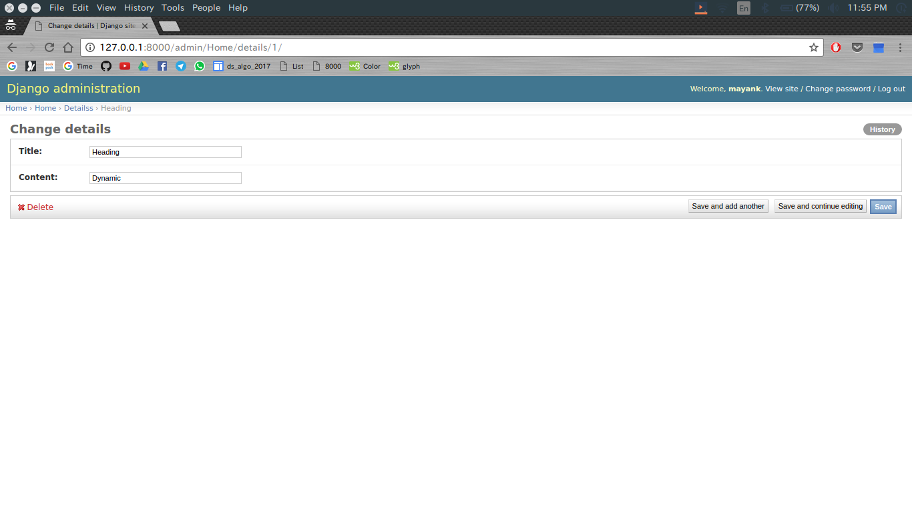
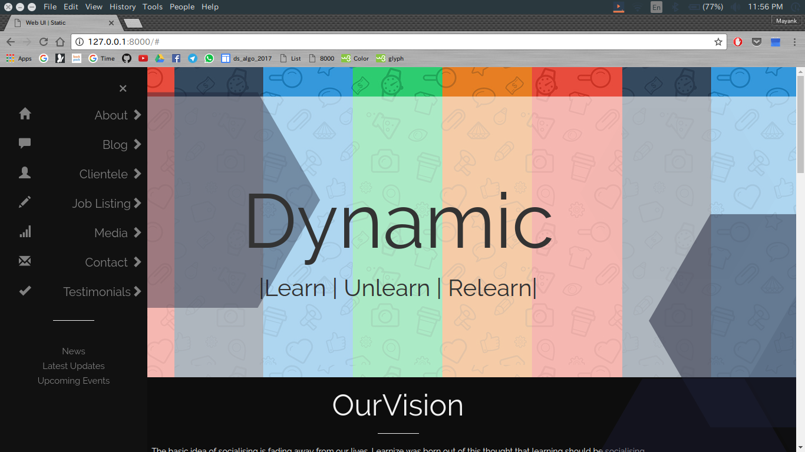
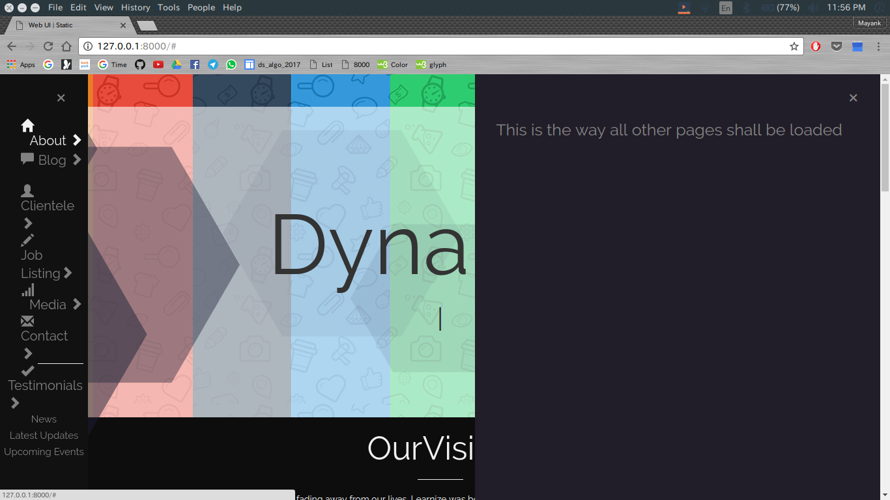

# dynamic_webster
Adding Dynamics to the website displayed

## Aim
Made project tile-web Dynamic using Djnago.

## How to View
- Just like any other django project
- Get to directory
- python manage.py runserver
- Browser -> localhost:8000
- That's It!

## Screenshots

 

 

## Technologies Used

- Python
- Django
- HTML
- CSS
- Javascript
